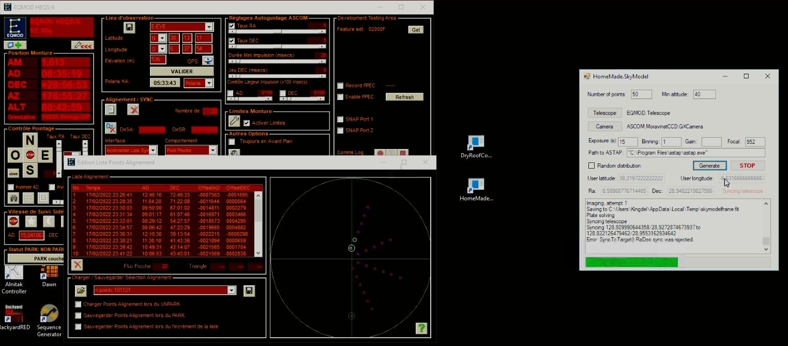

# HomeMade.SkyModel
Having seen a demo of PlaneWave's telescope alignment sequence, I thought it would be possible to do the same thing for all telescopes.

Sky model builder allows the creation of sky models in ASCOM mounts with large number of points (e.g 50, 100).

It connects directly to ASCOM mounts and ASCOM cameras and builds the model via sync (the mount and the driver need to understand it). For example, for EQMOD, setting the behaviour of sync to "add to the list" will build a model. Then select "load model at unpark" to load the model every time the telescope is started. Something similar can be done with Gemini mounts.

It uses ASTAP for plate solving.

